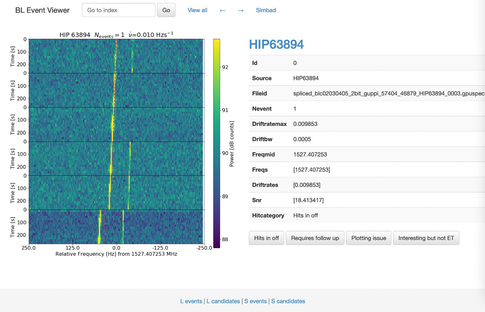

# EventViewer

This is a web-based image viewer for quickly categorizing candidate signals into real or RFI. 

It is a tiny [flask](http://flask.pocoo.org/) app, built with [bootstrap](http://getbootstrap.com/),
which will display images and their meta information from a table with pagination. It is based on [ImageViewer](https://github.com/smoh/imageviewer) by @smoh.


## Test out

Do
```sh
git clone https://github.com/ucberkeleyseti/event_viewer_
cd event_viewer
conda env create    # will create viewer conda environment specified in environment.yml
source activate viewer
python app.py
```
and point your browser to `localhost:8001`.

This will show images and their accompanying metadata



Configure static file paths in `app.py` and modify templates in `templates/`
according to your needs. [Flask](http://flask.pocoo.org/) uses the [jinja](http://jinja.pocoo.org/) template engine.

